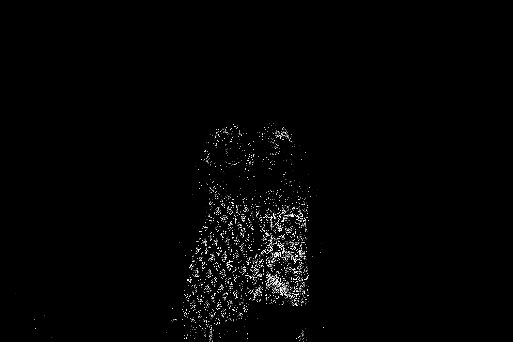

# Laplacian Edge Detection using Second-Order Derivatives


A lightweight image processing program written in C that performs edge detection on grayscale images using the Discrete Laplacian Operator. 

This project was developed as part of **Calculus PBL Set 2** to demonstrate how concepts from multivariable calculus—particularly second-order partial derivatives—can be transformed into practical algorithms used in computer vision and spatial domain image processing.

---

## Mathematical Background

An image can be modeled mathematically as a continuous intensity function $f(x,y)$, where the domain consists of continuous spatial coordinates $(x,y) \in \mathbb{R}^2$ and the range represents the brightness of the image at that point. 

To detect edges, we seek regions where the intensity changes rapidly. The **Laplacian Operator** is a second-order differential operator defined as the sum of the unmixed second partial derivatives:

$$
\nabla^2 f = \frac{\partial^2 f}{\partial x^2} + \frac{\partial^2 f}{\partial y^2}
$$

Unlike first derivatives, which measure the rate of change (gradient), the Laplacian measures the total curvature of the function. Large Laplacian magnitudes occur at locations where intensity undergoes abrupt transitions, making the operator highly effective for edge detection.

---

## From Continuous Functions to Digital Images

Digital images are not continuous surfaces; they are discrete grids of pixels where coordinates exist in $\mathbb{Z}^2$. Because we are directly manipulating these discrete pixel values, this processing occurs entirely in the **spatial domain**. 

To approximate the continuous Laplacian numerically, we use finite difference methods.

For the second derivative along the $x$-axis:

$$
\frac{\partial^2 f}{\partial x^2} \approx f(x+1,y) - 2f(x,y) + f(x-1,y)
$$

Similarly, along the $y$-axis:

$$
\frac{\partial^2 f}{\partial y^2} \approx f(x,y+1) - 2f(x,y) + f(x,y-1)
$$

Adding both approximations yields the **discrete Laplacian**:

$$
\nabla^2 f(x,y) = f(x+1,y) + f(x-1,y) + f(x,y+1) + f(x,y-1) - 4f(x,y)
$$

This equation forms the core mathematical foundation of the C implementation.

---

## Convolution Representation

The discrete Laplacian can be represented as a convolution kernel. By sliding this $3 \times 3$ grid across the spatial domain of our pixels, we calculate the derivatives programmatically:

$$
\begin{bmatrix}
0 & 1 & 0 \\
1 & -4 & 1 \\
0 & 1 & 0
\end{bmatrix}
$$

For every pixel, the kernel computes a weighted combination of neighboring intensities. Regions of nearly constant intensity produce responses close to zero, while strong intensity transitions produce large positive or negative responses.

---

## Edge Classification

Let $L(x,y)$ denote the Laplacian response. The implementation computes the absolute value $|L(x,y)|$ and applies a hard threshold to generate a binary edge map:

$$
E(x,y) = \begin{cases} 
255, & |L(x,y)| > T \\ 
0, & |L(x,y)| \le T 
\end{cases}
$$

where the threshold $T = 30$ in the current implementation. 

### Why This Works
Consider a region of constant intensity where $f(x+1,y) \approx f(x,y) \approx f(x-1,y)$. In such regions, $\nabla^2 f(x,y) \approx 0$ and the output remains dark. At object boundaries, neighboring pixel values differ significantly, causing the discrete Laplacian to attain large magnitudes. These locations are highlighted in the resulting edge map. 

---

## How to Run the Program

### Compilation

The project requires only a standard C compiler and has no external dependencies.

```bash
gcc -Wall -Wextra -O2 -o edge_detector main.c
```

### Usage

The program expects exactly two command-line arguments:

1. The input image file (must be a binary **P5 PGM** image).
2. The desired output file name.

Run the program as follows:

```bash
./edge_detector input.pgm output.pgm
```

**Example:**
```bash
./edge_detector lena.pgm lena_edges.pgm
```

Upon execution, the program loads the input image, computes the discrete Laplacian response at every pixel, applies thresholding, and writes the resulting edge map to the specified output file.

---

## Supported Image Format

The implementation currently supports grayscale images stored in the **Portable GrayMap (PGM)** format using binary **P5** encoding.

Example header:

```text
P5
512 512
255
```

where:

* `P5` specifies binary grayscale encoding.
* `512 512` denotes image width and height.
* `255` is the maximum pixel intensity value.

---

## Example Output

The following example demonstrates the effect of applying the Laplacian operator to a grayscale image.

| Original Image (`input.pgm`) | Edge Map (`output.pgm`) |
| :--------------------------: | :---------------------: |
|  |  |

The output image highlights regions of rapid intensity variation. Pixels corresponding to detected edges are rendered white (**255**), while non-edge regions remain black (**0**).

---

## Computational Complexity

For an image containing $N = \text{width} \times \text{height}$ pixels:

* **Time Complexity:** $O(N)$
  Each pixel is visited exactly once and requires a constant number of arithmetic operations.
* **Space Complexity:** $O(N)$
  An additional image buffer is allocated to store the resulting edge map.
